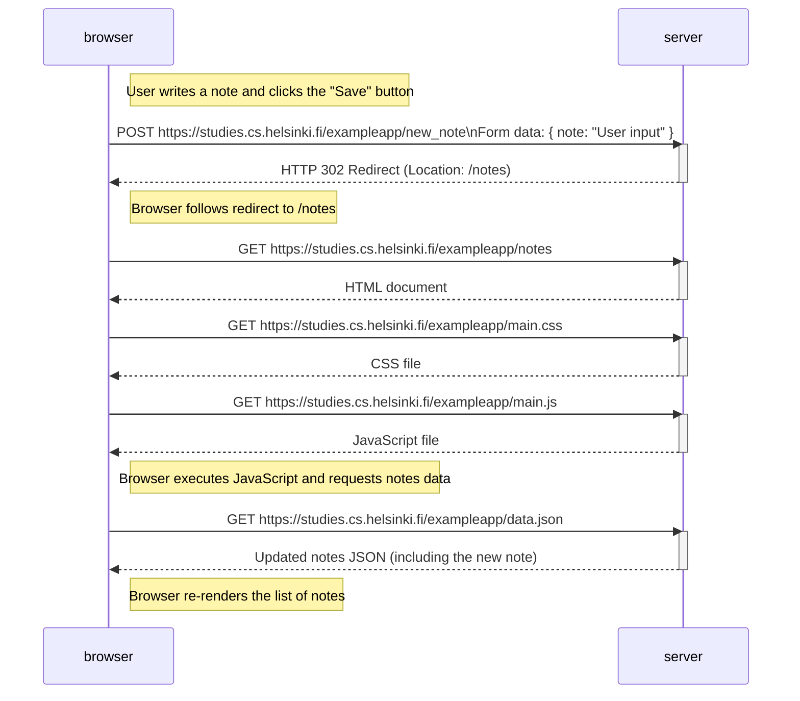

```mermaid
sequenceDiagram
    participant browser
    participant server

    Note right of browser: User writes a note and clicks the "Save" button

    browser->>server: POST https://studies.cs.helsinki.fi/exampleapp/new_note\nForm data: { note: "User input" }
    activate server
    server-->>browser: HTTP 302 Redirect (Location: /notes)
    deactivate server

    Note right of browser: Browser follows redirect to /notes

    browser->>server: GET https://studies.cs.helsinki.fi/exampleapp/notes
    activate server
    server-->>browser: HTML document
    deactivate server

    browser->>server: GET https://studies.cs.helsinki.fi/exampleapp/main.css
    activate server
    server-->>browser: CSS file
    deactivate server

    browser->>server: GET https://studies.cs.helsinki.fi/exampleapp/main.js
    activate server
    server-->>browser: JavaScript file
    deactivate server

    Note right of browser: Browser executes JavaScript and requests notes data

    browser->>server: GET https://studies.cs.helsinki.fi/exampleapp/data.json
    activate server
    server-->>browser: Updated notes JSON (including the new note)
    deactivate server

    Note right of browser: Browser re-renders the list of notes
```