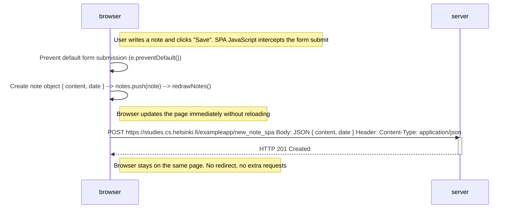

```mermaid
sequenceDiagram
    participant browser
    participant server

    Note right of browser: User writes a note and clicks "Save". SPA JavaScript intercepts the form submit
    
    browser->>browser: Prevent default form submission (e.preventDefault())
    browser->>browser: Create note object { content, date } --> notes.push(note) --> redrawNotes()

    Note right of browser: Browser updates the page immediately without reloading
    
    browser->>server: POST https://studies.cs.helsinki.fi/exampleapp/new_note_spa Body: JSON { content, date } Header: Content-Type: application/json
    activate server
    server-->>browser: HTTP 201 Created
    deactivate server

    Note right of browser: Browser stays on the same page. No redirect, no extra requests

```